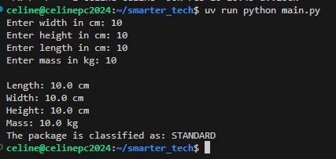
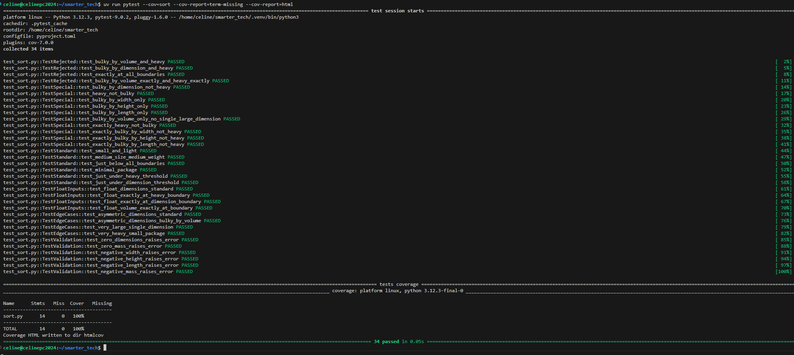

# Smarter Technologies

- [Smarter Technologies](#smarter-technologies)
  - [Overview](#overview)
  - [Project Setup](#project-setup)
  - [Running the Project](#running-the-project)
  - [Running Tests](#running-tests)
  - [Approach](#approach)
  - [Core Engineering Technical Screen](#core-engineering-technical-screen)
    - [Objective](#objective)
    - [Rules](#rules)
    - [Implementation](#implementation)
    - [Submission Guidance](#submission-guidance)

## Overview

This is my submission for the Smarter Technologies 'Core Engineering Technical Screen'. You can use the table of 
contents above to setup the project, run it, and execute the test cases. Finally there is a section documenting
my approach to this problem.

## Project Setup

Requires Python 3.11+ and [uv](https://docs.astral.sh/uv/) package manager. Optionally, you can install 
`make` to use the simplified commands.

```bash
sudo apt-get install make
```

You can install uv and create the venv with the following.

```bash
# Install uv (if not already installed)
curl -LsSf https://astral.sh/uv/install.sh | sh

# Create virtual environment and install dependencies
make venv-create

# Or manually with uv
uv venv
uv sync --all-extras
```

## Running the Project

If you have make installed you can simply run:

```bash
make run
```

Or you can directly execute the project with:

```bash
uv run python main.py
```

The CLI will prompt for package dimensions (width, height, length in cm) and mass (in kg), then output the classification. For example:



## Running Tests

This project also includes a test suite, [using PyTest](https://docs.pytest.org/en/stable/index.html), of 34 tests covering:

- Classification logic (REJECTED, SPECIAL, STANDARD)
- Boundary conditions and edge cases
- Float input handling
- Input validation (positive values required)

Having good test cases is paramount to building great products, so I included them here.

Tests can be run as follows if you have `make` installed.

```bash
# Run all tests
make test

# Run tests with coverage report
make test-coverage
```

If not you can run them manually as follows.

```bash
# Run all tests
uv run pytest .

# Run tests with coverage report
uv run pytest --cov=sort --cov-report=term-missing --cov-report=html
```



## Approach

The project is organized into three modules, each with a single responsibility:

`main.py`

- Entry point that handles user I/O.
- Helper function validates that all inputs are positive numbers.
- Displays classification result after processing.

`sort.py`

- Implements the classification algorithm as defined in the requirements.
- Uses named constants (`VOLUME_THRESHOLD`, `DIMENSION_THRESHOLD`, `MASS_THRESHOLD`) for clarity and ease of control.
- Includes input validation that raises `ValueError` for non-positive values.

`test_sort.py`

- Comprehensive test suite with 34 tests organized by classification type.
- Covers boundary conditions, float inputs, and validation errors.

## Core Engineering Technical Screen

### Objective

Imagine you work in Smarter Technology’s robotic automation factory, and your objective is to write
a function for one of its robotic arms that will dispatch the packages to the correct stack according
to their volume and mass.

### Rules

Sort the packages using the following criteria:

- A package is **bulky** if its volume (Width x Height x Length) is greater than or equal to 1,000,000 cm³ or when one of its dimensions is greater or equal to 150 cm.
- A package is **heavy** when its mass is greater or equal to 20 kg.

You must dispatch the packages in the following stacks:

- **STANDARD**: standard packages (those that are not bulky or heavy) can be handled normally.
- **SPECIAL**: packages that are either heavy or bulky can't be handled automatically.
- **REJECTED**: packages that are **both** heavy and bulky are rejected.

### Implementation

Implement the function **`sort(width, height, length, mass)`** (units are centimeters for the dimensions and kilogram for the mass). This function must return a string: the name of the stack where the package should go.

### Submission Guidance

1. **Time Management**: Allocate no more than 30 minutes to complete this challenge.
2. **Programming Language**: You may use any programming language you're comfortable with. This is an opportunity to showcase your skills in a language you are proficient in.
3. **Submission Format**:
   - **Option 1**: Submit a public GitHub repository with clear README instructions.
   - **Option 2 (Preferred)**: Host your solution on an online IDE like [Repl.it](http://repl.it/) or CodePen for immediate code review. Ensure the link is accessible for direct execution.
4. **Evaluation Criteria**: Submissions will be assessed on:
   - Correct sorting logic.
   - Code quality.
   - Handling edge cases and inputs.
   - Test coverage.
